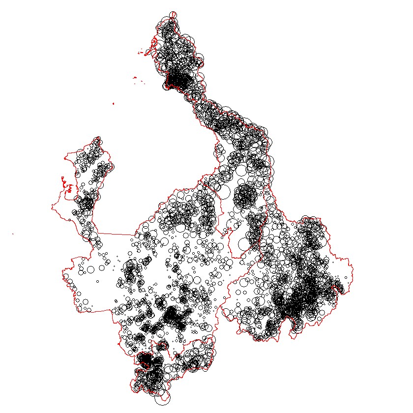
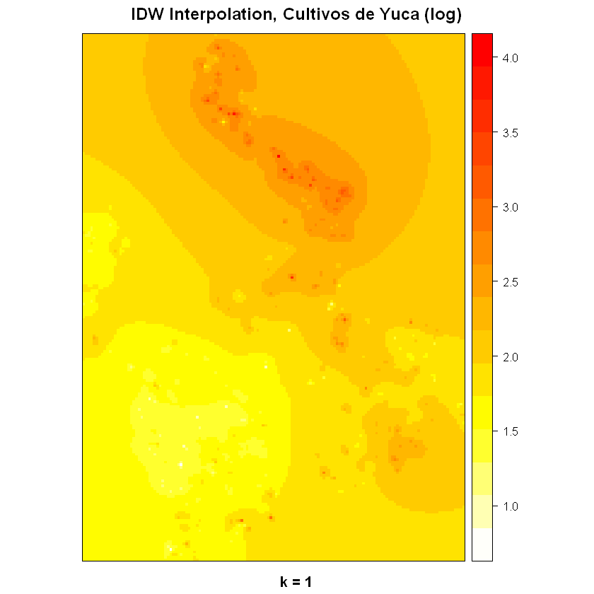

# Modelos Espaciales

## Patrones Puntuales

En una sesión anterior se trabajó sobre la información disponible en el portal del DANE sobre el Censo Agropecuario. Para el ejercicio se seleccionará el cultivo de la Yuca (`Código 00159201001`).

El primer paso consiste en importar los datos. Previamente, se ha hecho la selección de datos y se ha almacenado localmente con el nombre de `Cultivos.RData` por lo que el procedimiento de importación y selección se obviará en el ejercicio y se procederá a la carga directa desde el directorio local:


```R
load('Total_nacional(csv)/Cultivos.RData')
```

Ahora se verifica la estructura (para determinar si hay que hacer algún ajuste en el tipo de variables)


```R
str(Cultivos)
```

    'data.frame':	5335518 obs. of  23 variables:
     $ TIPO_REG      : int  4 4 4 4 4 4 4 4 4 4 ...
     $ PAIS          : int  170 170 170 170 170 170 170 170 170 170 ...
     $ P_DEPTO       : chr  "05" "05" "05" "05" ...
     $ P_MUNIC       : chr  "05001" "05001" "05001" "05001" ...
     $ UC_UO         : chr  "00010000" "00010000" "00010000" "00010000" ...
     $ ENCUESTA      : chr  "087000798" "087000798" "087000798" "087000798" ...
     $ COD_VEREDA    : chr  "05001999" "05001999" "05001999" "05001999" ...
     $ P_S6P45B      : int  1 1 1 1 1 1 2 3 3 3 ...
     $ P_S6P45A      : int  2 2 2 2 2 2 1 2 1 1 ...
     $ P_S6P46       : chr  "00112201001" "00112201001" "00151001001" "00151001001" ...
     $ P_S6P47A      : int  11 9 8 3 8 8 5 2 2 3 ...
     $ P_S6P47B      : int  2012 2013 2013 2013 2012 2013 2007 2013 2006 1997 ...
     $ P_S6P48       : int  2 2 2 2 2 2 1 2 2 2 ...
     $ P_S6P50       : int  2 2 2 2 2 2 1 2 1 1 ...
     $ P_S6P51_SP1   : int  NA NA NA NA NA NA NA NA NA NA ...
     $ P_S6P51_SP2   : int  1 1 1 1 1 1 1 1 1 1 ...
     $ P_S6P51_SP3   : int  NA NA NA NA NA NA NA NA NA NA ...
     $ P_S6P53       : int  NA NA NA NA NA NA NA NA 2 NA ...
     $ P_S6P57A      : num  3.13 0 0 15.29 14.26 ...
     $ P_S6P59_UNIF  : num  3.28 NA NA 16.02 14.95 ...
     $ P_S6P60       : int  12 12 12 12 12 12 12 12 12 12 ...
     $ AREA_SEMBRADA : num  0.954 0.954 0.954 0.954 0.954 ...
     $ AREA_COSECHADA: num  0.954 0 0 0.954 0.954 ...
     - attr(*, "spec")=List of 2
      ..$ cols   :List of 23
      .. ..$ TIPO_REG      : list()
      .. .. ..- attr(*, "class")= chr  "collector_integer" "collector"
      .. ..$ PAIS          : list()
      .. .. ..- attr(*, "class")= chr  "collector_integer" "collector"
      .. ..$ P_DEPTO       : list()
      .. .. ..- attr(*, "class")= chr  "collector_character" "collector"
      .. ..$ P_MUNIC       : list()
      .. .. ..- attr(*, "class")= chr  "collector_character" "collector"
      .. ..$ UC_UO         : list()
      .. .. ..- attr(*, "class")= chr  "collector_character" "collector"
      .. ..$ ENCUESTA      : list()
      .. .. ..- attr(*, "class")= chr  "collector_character" "collector"
      .. ..$ COD_VEREDA    : list()
      .. .. ..- attr(*, "class")= chr  "collector_character" "collector"
      .. ..$ P_S6P45B      : list()
      .. .. ..- attr(*, "class")= chr  "collector_integer" "collector"
      .. ..$ P_S6P45A      : list()
      .. .. ..- attr(*, "class")= chr  "collector_integer" "collector"
      .. ..$ P_S6P46       : list()
      .. .. ..- attr(*, "class")= chr  "collector_character" "collector"
      .. ..$ P_S6P47A      : list()
      .. .. ..- attr(*, "class")= chr  "collector_integer" "collector"
      .. ..$ P_S6P47B      : list()
      .. .. ..- attr(*, "class")= chr  "collector_integer" "collector"
      .. ..$ P_S6P48       : list()
      .. .. ..- attr(*, "class")= chr  "collector_integer" "collector"
      .. ..$ P_S6P50       : list()
      .. .. ..- attr(*, "class")= chr  "collector_integer" "collector"
      .. ..$ P_S6P51_SP1   : list()
      .. .. ..- attr(*, "class")= chr  "collector_integer" "collector"
      .. ..$ P_S6P51_SP2   : list()
      .. .. ..- attr(*, "class")= chr  "collector_integer" "collector"
      .. ..$ P_S6P51_SP3   : list()
      .. .. ..- attr(*, "class")= chr  "collector_integer" "collector"
      .. ..$ P_S6P53       : list()
      .. .. ..- attr(*, "class")= chr  "collector_integer" "collector"
      .. ..$ P_S6P57A      : list()
      .. .. ..- attr(*, "class")= chr  "collector_double" "collector"
      .. ..$ P_S6P59_UNIF  : list()
      .. .. ..- attr(*, "class")= chr  "collector_double" "collector"
      .. ..$ P_S6P60       : list()
      .. .. ..- attr(*, "class")= chr  "collector_integer" "collector"
      .. ..$ AREA_SEMBRADA : list()
      .. .. ..- attr(*, "class")= chr  "collector_double" "collector"
      .. ..$ AREA_COSECHADA: list()
      .. .. ..- attr(*, "class")= chr  "collector_double" "collector"
      ..$ default: list()
      .. ..- attr(*, "class")= chr  "collector_guess" "collector"
      ..- attr(*, "class")= chr "col_spec"
    

Para facilidad, se cambia la variable `P_S6P46` que es tipo cadena de caracteres a tipo factor:


```R
Cultivos$P_S6P46<-factor(Cultivos$P_S6P46)
```

Y se seleccionan las observaciones correspondientes al cultivo a analizar:


```R
cultivo1<-Cultivos[Cultivos$P_S6P46=='00159201001',]
```

En el nuevo conjunto de datos se ajustan las otras variables que se requieren:


```R
cultivo1$P_DEPTO<-factor(cultivo1$P_DEPTO)
cultivo1$P_MUNIC<-factor(cultivo1$P_MUNIC)
cultivo1$COD_VEREDA<-factor(cultivo1$COD_VEREDA)
```

Y se remueve lo que no se necesita con el fin de liberar memoria:


```R
rm(Cultivos)
```

Para cargar el mapa se emplea la función `readOGR` de la librería `rgdal`:


```R
library(rgdal)
```

    Loading required package: sp
    rgdal: version: 1.3-6, (SVN revision 773)
     Geospatial Data Abstraction Library extensions to R successfully loaded
     Loaded GDAL runtime: GDAL 2.2.3, released 2017/11/20
     Path to GDAL shared files: D:/Documentos/R/win-library/3.5/rgdal/gdal
     GDAL binary built with GEOS: TRUE 
     Loaded PROJ.4 runtime: Rel. 4.9.3, 15 August 2016, [PJ_VERSION: 493]
     Path to PROJ.4 shared files: D:/Documentos/R/win-library/3.5/rgdal/proj
     Linking to sp version: 1.3-1 
    


```R
veredas <- readOGR(dsn = 'Mapas', layer = 'VEREDAS_V27')
```

    OGR data source with driver: ESRI Shapefile 
    Source: "D:\Dropbox (Personal)\UIS\0000 SEMINARIO ESPACIAL\Bases\CENSO AGROPECUARIO\Total_nacional(csv)\Mapas", layer: "VEREDAS_V27"
    with 32305 features
    It has 14 fields
    

    Warning message in readOGR(dsn = "Mapas", layer = "VEREDAS_V27"):
    "Z-dimension discarded"

Antes de proseguir, se hace la selección de los departamentos a analizar y se unifican nombres de variables. En este caso específico se trabajará con `Antioquia (05)`, `Santander (68)`, `Caldas (17)` y `Bolivar (13)`:


```R
cultivo1$COD_DPTO<-cultivo1$P_DEPTO; cultivo1$P_DEPTO<-NULL
cultivo.region<-cultivo1[cultivo1$COD_DPTO=='68' | 
                           cultivo1$COD_DPTO=='05' |
                           cultivo1$COD_DPTO=='17' |
                           cultivo1$COD_DPTO=='13',c(3,6,9,23)]
```

El mismo procedimiento pero con el mapa:


```R
region<-veredas[veredas$COD_DPTO=='68' | 
              veredas$COD_DPTO=='05' |
              veredas$COD_DPTO=='17' |
              veredas$COD_DPTO=='13',]
plot(region)
```


Se siguen removiendo elementos que no se requieren; columnas que para el caso no se van a emplar u objetos innecesarios:


```R
rm(cultivo1)
region.cultivo<-region[, c(12,2,3)]
rm(region)
```

Con una tabla de contingencia es posible hacer el conteo requerido. Como se planteó en la actividad previa se busca describir dos cultivos mediante el análisis de patrones puntuales y el análisis de áreas. La tabla se construye y se transforma en `data frame` mediante las siguientes lineas:


```R
tabla<-with(cultivo.region, as.data.frame(table(COD_VEREDA,P_S6P46)))
```

Y se seleccionan aquellas ubicaciones donde hay presencia de cultivos para, luego, remover lo que no se requiere:


```R
puntos1<-tabla[tabla$Freq!=0,]
rm(tabla)
```

Ahora, se requiere transformar la tabla creada en Patrones Puntuales. Primero, se extraen las coordenadas a partir del los mapas dentro del entorno de trabajo:


```R
region.df<-data.frame(Lon=coordinates(region.cultivo)[,1],
                      Lat=coordinates(region.cultivo)[,2],
                      COD_VEREDA=region.cultivo@data$CODIGO_VER)
```

Los datos existentes se unen mediante el comando `merge` y se crea un nuevo `data frame`:


```R
df.cultivo<-merge(puntos1,region.df, by = 'COD_VEREDA')
```

Y, se sibuja para verificar (este paso no es necesario):


```R
with(df.cultivo,plot(Lon,Lat, pch = 19))
```


Ese `data frame` se convierte en `patrones puntuales` con la ayuda de la librería `sp`:


```R
library(sp)
```

Primero, se extraen las coordenadas:


```R
coordinates=as.matrix(df.cultivo[,c(4,5)])
```

Luego se determina la proyección dentro del `GIS`:


```R
myCRS<- CRS("+proj=utm +zone=17 +datum=WGS84")
```

Y se transforma en puntos espaciales:


```R
mypoints=SpatialPointsDataFrame(coords=coordinates, data=df.cultivo[,c(1:3)], proj4string = myCRS)
```

Ahora, la gráfica:


```R
plot(mypoints, pch = 20, col = 'red')
plot(region.cultivo, border = 'grey', add = T)
```


En términos descriptivos, es mejor usar unidades territoriales más grandes para referencia visual, por esta razón se empleará el mapa de departamentos para la gráfica. Como siempre, el primer paso es importar los objetos y luego seleccionar los fragmentos de datos. Para liberar memoria se pueden remover objetos que no se vayan a emplear:


```R
rm(region.cultivo)
departamentos <- readOGR(dsn = 'Mapas', layer = 'DepartamentosVeredas')
depart.cultivo<-departamentos[departamentos$DPTO_CCDGO=='68'|
                                departamentos$DPTO_CCDGO=='05'|
                                departamentos$DPTO_CCDGO=='17'|
                                departamentos$DPTO_CCDGO=='13',]
```

    OGR data source with driver: ESRI Shapefile 
    Source: "D:\Dropbox (Personal)\UIS\0000 SEMINARIO ESPACIAL\Bases\CENSO AGROPECUARIO\Total_nacional(csv)\Mapas", layer: "DepartamentosVeredas"
    with 33 features
    It has 1 fields
    

    Warning message in readOGR(dsn = "Mapas", layer = "DepartamentosVeredas"):
    "Z-dimension discarded"

Con todo lo anterior se tiene:


```R
plot(mypoints, pch = 20, col = 'grey')
plot(depart.cultivo, border = 'red', add = T)
```


O, si se quiere, el detalle por municipio:


```R
municipios <- readOGR(dsn = 'Mapas', layer = 'MunicipiosVeredas')
munic.cultivo<-municipios[municipios$DPTO_CCDGO=='68'|
                            municipios$DPTO_CCDGO=='05'|
                            municipios$DPTO_CCDGO=='17'|
                            municipios$DPTO_CCDGO=='13',]
```

    OGR data source with driver: ESRI Shapefile 
    Source: "D:\Dropbox (Personal)\UIS\0000 SEMINARIO ESPACIAL\Bases\CENSO AGROPECUARIO\Total_nacional(csv)\Mapas", layer: "MunicipiosVeredas"
    with 1121 features
    It has 5 fields
    

    Warning message in readOGR(dsn = "Mapas", layer = "MunicipiosVeredas"):
    "Z-dimension discarded"


```R
plot(mypoints, pch = 20, col = 'grey', axes = T)
plot(munic.cultivo, border = 'red', add = T)
plot(depart.cultivo, border = 'black', add = T)
```


Otra forma de representarlo:


```R
par(mar=rep(0,4))
plot(mypoints,pch=1,cex=log(mypoints$Freq)/2)
plot(depart.cultivo, border = 'red', add = T)
```





Y otra forma más


```R
bubble(mypoints,"Freq")
```


Para construir el variograma, hacer la interpolación y calcular la semivarianza es mejor (y más práctico), extraer una muestra. Para el ejemplo, se seleccionará una muestra de tamaño 500. Se parte del `data frame` de los cultivos:


```R
data <- df.cultivo
```

Y se extrae la muestra:


```R
data <- data[sample(500,replace=F),]
names(data)
head(data)
dim(data)
```


<ol class=list-inline>
	<li>'COD_VEREDA'</li>
	<li>'P_S6P46'</li>
	<li>'Freq'</li>
	<li>'Lon'</li>
	<li>'Lat'</li>
</ol>


<table>
<thead><tr><th></th><th scope=col>COD_VEREDA</th><th scope=col>P_S6P46</th><th scope=col>Freq</th><th scope=col>Lon</th><th scope=col>Lat</th></tr></thead>
<tbody>
	<tr><th scope=row>193</th><td>05044010   </td><td>00159201001</td><td> 3         </td><td>-75.91894  </td><td>6.274833   </td></tr>
	<tr><th scope=row>400</th><td>05120022   </td><td>00159201001</td><td>46         </td><td>-75.20573  </td><td>7.599204   </td></tr>
	<tr><th scope=row>337</th><td>05107007   </td><td>00159201001</td><td> 2         </td><td>-75.52347  </td><td>7.024120   </td></tr>
	<tr><th scope=row>33</th><td>05002059   </td><td>00159201001</td><td> 1         </td><td>-75.45447  </td><td>5.896363   </td></tr>
	<tr><th scope=row>364</th><td>05113017   </td><td>00159201001</td><td>15         </td><td>-75.87806  </td><td>6.826806   </td></tr>
	<tr><th scope=row>270</th><td>05051058   </td><td>00159201001</td><td> 3         </td><td>-76.51115  </td><td>8.563402   </td></tr>
</tbody>
</table>


<ol class=list-inline>
	<li>500</li>
	<li>5</li>
</ol>


Con la muestra se crean los nuevos objetos espaciales; premero las coordenadas y luego los puntos:


```R
sp_point <- matrix(NA, nrow=nrow(data),ncol=2)
sp_point[,1] <- jitter(data$Lon,.001)
sp_point[,2] <- jitter(data$Lat, .001)
colnames(sp_point) <- c("LONG","LAT")
```


```R
data.sp <- SpatialPointsDataFrame(coords=sp_point,data,proj4string=CRS("+proj=utm +zone=48 +datum=WGS84"))
```

Una pequeña exploración:


```R
par(mar=rep(0,4))
plot(data.sp,pch=1,cex=log(data.sp$Freq)/5)
```


Y se construye el variograma con ayuda del comando `variogram` de la librería `gstat`:


```R
library(gstat)
```


```R
plot(variogram(log(Freq)~1, locations=coordinates(sp_point), data=data.sp, cloud=T),pch=16, cex=1)
```


Un muestreo del variograma


```R
plot(variogram(log(Freq)~1, locations=coordinates(sp_point), data=data.sp, cloud=F),type="b",pch=16)
```


Una búsqueda direccional:


```R
plot(variogram(log(Freq)~1, locations=coordinates(sp_point), data=data.sp, alpha=c(0,45,90,135),cloud=T),pch=16)
```


Se modifican los puntos de corte:


```R
plot(variogram(log(Freq)~1, locations=coordinates(sp_point), data=data.sp, cutoff=.5 ,cloud=F),type="b", pch=16)
```


Y se compara con una distribución aleatoria


```R
v <- variogram(log(Freq) ~ 1, locations=coordinates(sp_point), data.sp)
```


```R
library(lattice)
```


```R
print(xyplot(gamma ~ dist, v, ylim=c(0,max(v$gamma)+2*sd(v$gamma)), pch = 3, type = 'b', lwd = 2,
             panel = function(x, y, ...) {
               for (i in 1:100) {
                 data.sp$random <- sample(data.sp$Freq)
                 v <- variogram(log(random) ~ 1, locations=coordinates(data.sp), data.sp)
                 llines(v$dist, v$gamma, col = 'grey')
               }
               panel.xyplot(x, y, ...)
             },
             xlab = 'distance', ylab = 'semivariance'
))
```


Y el variograma ajustado con el modelo exponencial


```R
v.fit <- fit.variogram(v, vgm(psill=1, model="Exp", range=1))
plot(v, v.fit, pch = 16,cex=.5)
```


## Kriging

El kriging ordinario sirve para realizar predicciones de procesos gaussianos y utiliza el variograma para realizar las ponderaciones de cada punto.

Primero, se construye una cuadrícula vacía donde se proyectan los puntos; para ello se usa la función `Sobj_SpatialGrid` de la librería `maptools`:


```R
library(maptools)
```

    Checking rgeos availability: TRUE
    


```R
grd <- Sobj_SpatialGrid(data.sp,maxDim=200)$SG

plot(grd,axes=T,col="grey")
points(data.sp, pch = 19, col = 'red')
```


Y, con la función `krige` se calcula el kringin ordinario:


```R
kr <- krige(log(Freq)~1, data.sp, grd, model=v.fit)
spplot(kr,col.regions=rev(terrain.colors(100)), names.attr=c("Prediciones","Varianza"),
       main="Kriging Ordinario,  Cultivos de  Yuca (log)",pch=2,cex=2)

```

    [using ordinary kriging]
    


### Interpolación

La interpolación de distancia inversa del kriging es una forma de predicción. Se parte de la distribución de los datos en una rejilla o cuadrícula


```R
grd <- Sobj_SpatialGrid(data.sp,maxDim=200)$SG

plot(grd,axes=T,col="grey")
points(data.sp, pch = 19, col = 'red')
```


Y se generan las predicciones (se emplearán varios valores de la distancia inversa `k`):


```R
idw.out <- idw(log(Freq)~1,data.sp,grd,idp=.2)
spplot(idw.out[1],col.regions=rev(heat.colors(100)),
       main="IDW Interpolacion, Cultivos de Yuca (log)",sub="k = 1/5")

```

    [inverse distance weighted interpolation]
    


```R
# k=1
idw.out <- idw(log(Freq)~1,data.sp,grd,idp=1)
spplot(idw.out[1],col.regions=rev(heat.colors(100)), 
main="IDW Interpolation, Cultivos de Yuca (log)",sub="k = 1")
```

    [inverse distance weighted interpolation]
    


```R
# k=5
idw.out <- idw(log(Freq)~1,data.sp,grd,idp=5)
spplot(idw.out[1],col.regions=rev(heat.colors(100)), 
main="IDW Interpolation, Cultivos de Yuca (log)",sub="k = 5")
```

    [inverse distance weighted interpolation]
    




